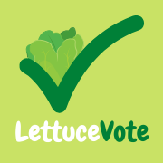
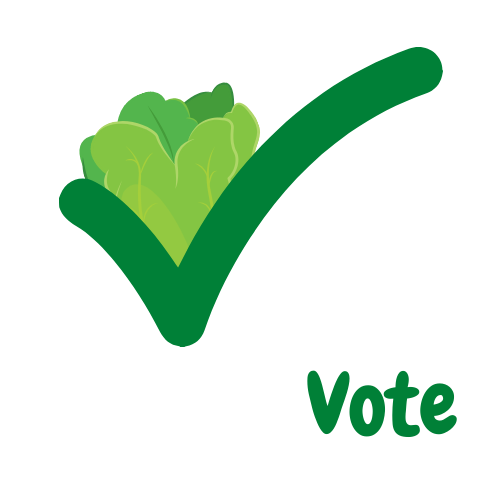

# LettuceVote

## An app to collectively select restaurants with friends & family

### How does LettuceVote work?

1. Join or a create a group with your friends and/or family.
2. Input a location (or your current location) along with a radius (in miles) to get a list of restaurants in that area.
3. Set a down-vote limit, which determines how many down-votes are requried in order for a restaurant to be disqualified from consideration.
4. Scroll through the list of restaurants. Tap on each one to view additional information about them, including the restaurant's price range, hours, location, and phone number.
5. If you like a restaurant, tap the up-vote button and the restaurant will be bumped up the list, which will be ordered by how many up-votes each restaurant has. If you dislike a restaurant, tap the trash icon to down-vote it.
6. Once your group is done looking through restaurants, the admin of the group will tap end voting. 
7. The restaurant with the highest number of votes will be selected, and the app will direct you to the Maps app for directions to the restaurant.

### Demo Video Link

[https://youtu.be/FVpB5Eym2BA](https://youtu.be/FVpB5Eym2BA)

### Group Members

- Jeremy Cohen
- Matt Jogodnik
- Steven Oh
- Charles Papandreou
- Roy Xiong

### Implemented API's, Frameworks, and Platforms

- [Firebase](https://firebase.google.com/)
- [MapKit](https://developer.apple.com/documentation/mapkit)
- [US Restaurant Menus API](https://rapidapi.com/restaurantmenus/api/us-restaurant-menus)

### App Icon & Logos

LettuceVote App Icon

LettuceVote Logo 1 with Transparent Background ("Lettuce" will appear invisible if the background is white due to its white font color)

LettuceVote Logo 2 with Transparent Background ("Lettuce" will appear invisible if the background is white due to its white font color)

